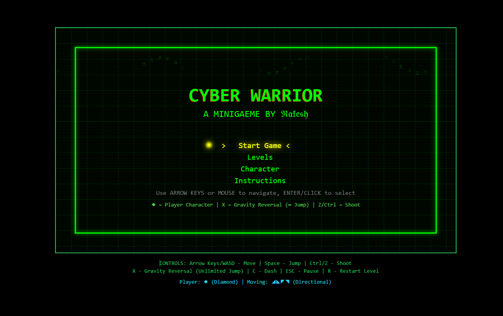

# Terminal Warrior

A browser-based platformer game with retro terminal aesthetics built using TypeScript and Canvas.

## Description

Terminal Warrior is a cyberpunk-themed platformer where players navigate through digital landscapes, collecting code fragments and battling system threats. The game features terminal-style graphics using monospace fonts and ASCII-like characters.

## Core Features

- Multiple playable levels across different sectors
- Character customization (symbols and colors)
- Weapon upgrade system
- Power-up mechanics
- Boss battles
- Particle effects
- Score tracking system

## Controls

- Movement: Arrow Keys / WASD
- Jump: Space / Up Arrow / W (Double Jump available)
- Shoot: Ctrl / Z
- Gravity Reversal: X (4 seconds duration with unlimited jumps)
- Dash: C (Short-range evasive maneuver with invulnerability)
- Pause: ESC
- Restart Level: R

## Game Elements

### Player Character
- Default appearance: ◆
- Directional movement indicators: ◢◣◤◥
- Customizable symbols and colors

### Collectibles
- Code Fragments (◦): Basic scoring items
- Data Chunks (●): High-value scoring items

### Power-ups
- Firewall Shield: Temporary invulnerability
- Overclock Chip: Movement speed boost
- Debug Pulse: Instant shoot ability recharge
- Restore Point: Checkpoint respawn
- Time Warp: Enemy slowdown effect
- Data Overload: Screen-clearing ability

### Hazards
- Glitch Bugs (※): Basic enemies
- Firewall Drones (◊): Flying enemies
- Antivirus Lasers (▲): Static hazards
- Moving Platforms (═): Navigation challenges
- Force Fields: Periodic damage zones
- Spike Traps: Emerging hazards

### Weapon Upgrades
- Rapid Fire (RF)
- Piercing (P)
- Spread (S)
- Power (PWR)

## Technical Details

Built with:
- TypeScript
- HTML5 Canvas
- React

## Game Structure
- Level-based progression
- Multiple sectors with increasing difficulty
- Boss encounters
- Score and time tracking
- Lives system
- HUD with power-up status and weapon

## Link 
- https://terminal-warrior.vercel.app/

## sreenshot
